# 15 Projets data pour un *Portfolio Professionnel*

Ton GitHub ne te vend pas, ce repo t'aide à changer ça :)

---

## Table des matières

- [Le problème](#le-problème)
- [Ce que contient ce repo](#ce-que-contient-ce-repo-gratuit)
- [Tu veux aller plus loin ?](#tu-veux-aller-plus-loin-)
- [Qui suis-je ?](#qui-suis-je-)
- [🔬 Data Scientist](#-data-scientist-5-projets)
  - [1. Prédiction de Churn Client - Télécoms](#1-prédiction-de-churn-client---télécoms)
  - [2. Détection de Fraude Bancaire Temps Réel](#2-détection-de-fraude-bancaire-temps-réel)
  - [3. Optimisation Prix E-commerce](#3-optimisation-prix-e-commerce)
  - [4. Analyse Sentiment Avis Produits](#4-analyse-sentiment-avis-produits)
  - [5. Prévision Consommation Énergétique](#5-prévision-consommation-énergétique)
- [📊 Data Analyst](#-data-analyst-5-projets)
  - [6. Dashboard KPIs E-commerce](#6-dashboard-kpis-e-commerce)
  - [7. Analyse Cohortes Application Mobile](#7-analyse-cohortes-application-mobile)
  - [8. Attribution Marketing Multi-Touch](#8-attribution-marketing-multi-touch)
  - [9. People Analytics - Turnover](#9-people-analytics---turnover)
  - [10. Supply Chain Analytics](#10-supply-chain-analytics)
- [⚙️ Data Engineer](#️-data-engineer-5-projets)
  - [11. Pipeline Crypto Trading](#11-pipeline-crypto-trading)
  - [12. ETL Open Data Gouvernement](#12-etl-open-data-gouvernement)
  - [13. Streaming Bluesky Analytics](#13-streaming-bluesky-analytics)
  - [14. Data Quality Platform](#14-data-quality-platform)
  - [15. Modern Data Stack Local](#15-modern-data-stack-local)
- [💡 Conseils pour Réussir](#-conseils-pour-réussir)
- [🔗 Ressources Complémentaires](#-ressources-complémentaires)

---

## Le problème

La plupart des GitHub de data analysts et data scientists tiennent en :
- des repos "test" ou "titanic_kaggle"
- zéro README lisible
- rien de déployé
- aucune cohérence entre projets

Résultat : les recruteurs passent, les opportunités aussi.

---

## Ce que contient ce repo (gratuit)

**15 projets data avec de vraies problématiques business** — pas du Titanic.

Chaque projet inclut :
- Une problématique métier réelle chiffrée
- Un dataset public ou une API gratuite
- Une architecture technique complète
- Des livrables professionnels attendus
- Des critères de réussite concrets

| Profil | Projets |
|---|---|
| 🔬 **Data Scientist** | Churn télécom · Fraude bancaire · Optimisation prix · Sentiment NLP · Prévision énergie |
| 📊 **Data Analyst** | KPIs e-commerce · Cohortes mobile · Attribution marketing · People Analytics · Supply Chain |
| ⚙️ **Data Engineer** | Pipeline crypto · ETL Open Data · Streaming Bluesky · Data Quality Platform · Modern Data Stack |

---

## Tu veux aller plus loin ?

Ce repo te donne les idées. Les formations ci-dessous te donnent 
la structure, les outils et la méthode pour les réaliser.

| Ton besoin | La solution | Prix |
|---|---|---|
| **J'ai un week-end, je veux shipper 3 projets pros** | [ShipData, le boilerplate data](https://www.mes-formations-data.fr/formation/shipdata) | 49€ |
| **Je veux le système complet : GitHub + LinkedIn + stratégie** | [Portfolio Impactant, la formation complète](https://www.mes-formations-data.fr/formation/portfolio-impactant) | 197€ |
| **Je veux créer des apps Streamlit production-ready** | [Streamlit Unleashed, des apps que les recruteurs bookmarkent](https://www.mes-formations-data.fr/formation/streamlit-unleashed) | 297€ |

---

## Qui suis-je ?

**Gaël Penessot** — TOP 10 Data Science France (Favikon)

- 📚 Auteur "Business Intelligence avec Python" (ENI Editions, 600+ ventes)
- 🎓 Formateur LinkedIn Learning
- 💼 29k+ abonnés LinkedIn
- 📬 Newsletter [DataGyver](lien) — tips data chaque mois

---

## 🔬 DATA SCIENTIST (5 projets)

### 1. Prédiction de Churn Client - Télécoms

**🎯 Problématique Business**
L'entreprise de télécommunications perd 25% de ses clients chaque année. Le coût d'acquisition d'un nouveau client (CAC) est 5x plus élevé que la rétention. Objectif : identifier les clients à risque 3 mois avant leur départ.

**📊 Dataset**
- **Source** : [Telco Customer Churn - IBM](https://www.kaggle.com/datasets/blastchar/telco-customer-churn)
- **Volume** : 7,043 clients avec 21 features
- **Features clés** : Démographie, services souscrits, historique paiements, support client
- **Enrichissement** : Simuler des events temps réel avec Faker Python

**🏗️ Architecture Technique**
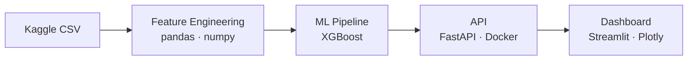

**📦 Livrables Attendus**
1. **Notebook Jupyter** avec analyse exploratoire (pandas, matplotlib, seaborn)
2. **Pipeline ML** avec scikit-learn et XGBoost (validation croisée)
3. **API REST** FastAPI containerisée avec Docker
4. **Dashboard Streamlit** pour visualiser les prédictions
5. **MLflow** pour tracker les expériences et modèles

**🎯 Critères de Réussite**
- Recall > 80% sur la classe churn (minimiser les faux négatifs)
- API avec latence < 100ms
- Déploiement Docker fonctionnel

**🛠️ Stack Recommandée**
- **ML** : Python, pandas, numpy, scikit-learn, XGBoost
- **MLOps** : MLflow, Docker
- **API** : FastAPI
- **Viz** : Streamlit, plotly
- **Dev** : Jupyter, Git

---

### 2. Détection de Fraude Bancaire Temps Réel

**🎯 Problématique Business**
La banque subit 2M€ de pertes annuelles dues à la fraude. Les transactions frauduleuses représentent 0.17% du volume mais 15% des pertes. Objectif : détecter 95% des fraudes en < 50ms.

**📊 Dataset**
- **Source** : [Credit Card Fraud Detection](https://www.kaggle.com/datasets/mlg-ulb/creditcardfraud)
- **Volume** : 284,807 transactions sur 2 jours
- **Simulation** : Créer un stream avec Python + générateur de nouvelles fraudes
- **Features** : 30 variables (PCA transformées) + montant + temps

**🏗️ Architecture Technique**
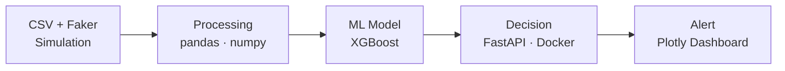

**📦 Livrables Attendus**
1. **Simulateur de transactions** avec Faker pour stream temps réel
2. **Feature engineering** avec pandas et numpy
3. **Modèle ML** XGBoost avec gestion du déséquilibre (SMOTE)
4. **API REST** FastAPI avec prédictions temps réel
5. **Dashboard monitoring** avec plotly/dash

**🎯 Critères de Réussite**
- Precision > 90% (limiter les faux positifs)
- Latence < 50ms par prédiction via API
- Containerisation Docker complète

**🛠️ Stack Recommandée**
- **ML** : Python, pandas, scikit-learn, XGBoost, imbalanced-learn
- **API** : FastAPI, uvicorn
- **Container** : Docker
- **Viz** : plotly, matplotlib
- **Dev** : Jupyter, VS Code

---

### 3. Optimisation Prix E-commerce

**🎯 Problématique Business**
La marketplace e-commerce veut maximiser son chiffre d'affaires en ajustant les prix selon la demande et l'élasticité. Objectif : +15% de CA sans perdre de volume.

**📊 Dataset**
- **Source** : [Brazilian E-Commerce Public Dataset](https://www.kaggle.com/datasets/olistbr/brazilian-ecommerce)
- **Volume** : 100k commandes, 32k produits
- **Enrichissement** : [API Exchange Rates](https://exchangeratesapi.io/) pour variations devise
- **Features** : Prix, catégorie, reviews, saisonnalité, géolocalisation

**🏗️ Architecture Technique**
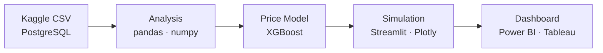

**📦 Livrables Attendus**
1. **Analyse exploratoire** avec pandas et matplotlib
2. **Modèle de demande** avec scikit-learn (régression, élasticité)
3. **Optimisation des prix** avec scipy.optimize
4. **Dashboard interactif** Streamlit ou Power BI Desktop
5. **Tests A/B simulés** pour validation stratégie

**🎯 Critères de Réussite**
- Identification de l'élasticité par segment
- Simulation montrant +10% CA potentiel
- Dashboard utilisable par les Product Managers

**🛠️ Stack Recommandée**
- **Data** : pandas, numpy, PostgreSQL
- **ML** : scikit-learn, XGBoost
- **Optimization** : scipy
- **Viz** : Power BI ou Tableau (versions gratuites)
- **Dev** : Jupyter, Git

---

### 4. Analyse Sentiment Avis Produits

**🎯 Problématique Business**
L'entreprise reçoit des milliers d'avis clients mais n'a pas le temps de les analyser. Objectif : extraire automatiquement les points positifs/négatifs par produit.

**📊 Dataset**
- **Source principale** : [Amazon Product Reviews](https://www.kaggle.com/datasets/snap/amazon-fine-food-reviews)
- **API temps réel** : [Reddit API](https://www.reddit.com/dev/api/) (gratuit avec limits)
- **Volume** : 568,454 avis Amazon + flux Reddit
- **Languages** : Principalement anglais

**🏗️ Architecture Technique**
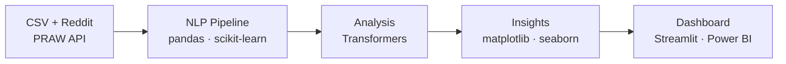

**📦 Livrables Attendus**
1. **Collecteur Reddit** avec PRAW (Python Reddit API Wrapper)
2. **Pipeline NLP** avec scikit-learn (TF-IDF, classification)
3. **Modèle sentiment** avec transformers pré-entraînés
4. **Visualisations** matplotlib/seaborn pour insights
5. **Dashboard Power BI** ou Streamlit avec métriques

**🎯 Critères de Réussite**
- Accuracy > 85% sur classification sentiment
- Extraction automatique des topics principaux
- Dashboard actualisé quotidiennement

**🛠️ Stack Recommandée**
- **APIs** : PRAW, requests
- **NLP** : scikit-learn, NLTK, transformers
- **Data** : pandas, numpy
- **Viz** : matplotlib, seaborn, Power BI
- **Deploy** : Docker, Streamlit

---

### 5. Prévision Consommation Énergétique

**🎯 Problématique Business**
Le gestionnaire réseau doit équilibrer production et consommation. Une erreur coûte 100k€/heure. Objectif : prédire la demande à H+1 et H+24.

**📊 Dataset**
- **Source historique** : [Hourly Energy Consumption](https://www.kaggle.com/datasets/robikscube/hourly-energy-consumption)
- **Météo temps réel** : [OpenWeatherMap API](https://openweathermap.org/api) (gratuit)
- **Volume** : 10 ans données horaires + météo live
- **Features** : Consommation, température, calendrier

**🏗️ Architecture Technique**
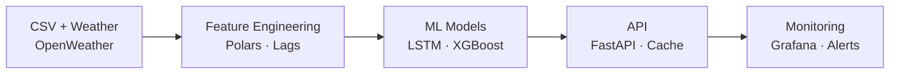

**📦 Livrables Attendus**
1. **Pipeline données** avec API météo temps réel
2. **Feature engineering** temporel (lags, rolling)
3. **Ensemble models** (LSTM + XGBoost)
4. **API prédiction** avec intervalles de confiance
5. **Dashboard monitoring** des performances

**🎯 Critères de Réussite**
- MAPE < 3% pour H+1
- API temps réel avec météo actuelle
- Alertes sur prédictions anormales

**🛠️ Stack Recommandée**
- **Time Series** : statsmodels, Prophet
- **Deep Learning** : TensorFlow/PyTorch
- **API météo** : requests + cache
- **Deploy** : Docker, FastAPI

---

## 📊 DATA ANALYST (5 projets)

### 6. Dashboard KPIs E-commerce

**🎯 Problématique Business**
La startup e-commerce n'a aucune visibilité sur ses performances. Excel ne suffit plus. Objectif : dashboard professionnel avec KPIs temps réel.

**📊 Dataset**
- **Source** : [Online Retail Dataset](https://archive.ics.uci.edu/dataset/352/online+retail)
- **Enrichissement** : [Faker](https://faker.readthedocs.io/) pour simuler données récentes
- **Volume** : 541,909 transactions + simulation temps réel
- **Métriques** : CA, panier moyen, conversion, cohortes

**🏗️ Architecture Technique**
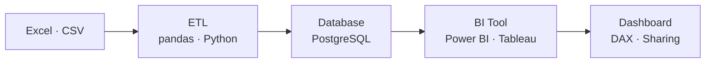

**📦 Livrables Attendus**
1. **ETL pipeline** Python avec pandas pour nettoyer les données
2. **Base PostgreSQL** avec modèle en étoile
3. **Dashboard Power BI** avec KPIs e-commerce (CA, conversion, etc.)
4. **Mesures DAX** avancées pour calculs complexes
5. **Version Tableau** alternative (Tableau Public gratuit)

**🎯 Critères de Réussite**
- Chargement dashboard < 3 secondes
- KPIs standards e-commerce complets
- Actualisation automatique quotidienne

**🛠️ Stack Recommandée**
- **ETL** : Python, pandas, SQLAlchemy
- **Database** : PostgreSQL ou MySQL
- **BI** : Power BI Desktop (gratuit) ou Tableau Public
- **Languages** : SQL, DAX (Power BI), Python
- **Deploy** : Power BI Service (version gratuite)

---

### 7. Analyse Cohortes Application Mobile

**🎯 Problématique Business**
L'app mobile perd 60% des utilisateurs après J+1. Objectif : comprendre les comportements et améliorer la rétention.

**📊 Dataset**
- **Source** : [Mobile App User Behavior](https://www.kaggle.com/datasets/daniilgorev/mobile-app-user-behavior-dataset)
- **Simulation events** : Générateur Python pour events in-app
- **Volume** : 100k users + events générés
- **Events** : Install, sessions, purchases, uninstall

**🏗️ Architecture Technique**
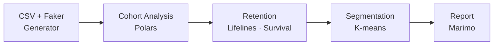

**📦 Livrables Attendus**
1. **Générateur d'events** réalistes avec patterns
2. **Analyse cohortes** par source d'acquisition
3. **Courbes de rétention** avec survival analysis
4. **Segmentation** comportementale des users
5. **Notebook Marimo** interactif avec insights

**🎯 Critères de Réussite**
- Identification de 3 segments utilisateurs clairs
- Recommandations actionnables pour le PM
- Visualisations compréhensibles

**🛠️ Stack Recommandée**
- **Analysis** : Polars, lifelines
- **Viz** : Plotly, seaborn
- **Interactive** : Marimo notebooks
- **Stats** : scipy, statsmodels

---

### 8. Attribution Marketing Multi-Touch

**🎯 Problématique Business**
L'entreprise dépense sur Google, Facebook, email sans savoir ce qui convertit. Objectif : modèle d'attribution pour optimiser le budget.

**📊 Dataset**
- **Source** : [Multi-Channel Marketing](https://www.kaggle.com/datasets/sudhanshu2198/multi-channel-marketing-data)
- **Google Trends** : [pytrends](https://pypi.org/project/pytrends/) pour données SEO
- **Volume** : 500k user journeys + trends temps réel
- **Canaux** : Paid search, social, email, organic

**🏗️ Architecture Technique**
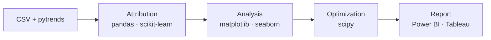

**📦 Livrables Attendus**
1. **Customer journey** mapping avec pandas
2. **Modèles attribution** (first/last click, linear, time decay)
3. **Analyse ROAS** par canal avec visualisations
4. **Optimisation budget** avec scipy.optimize
5. **Dashboard Power BI** pour équipe marketing

**🎯 Critères de Réussite**
- Attribution model validé vs conversions réelles
- Recommandations budget actionnables
- Dashboard self-service pour marketers

**🛠️ Stack Recommandée**
- **Data** : pandas, numpy, PostgreSQL
- **Attribution** : Python custom models
- **Trends** : pytrends API
- **Optimization** : scipy
- **BI** : Power BI ou Tableau

---

### 9. People Analytics - Turnover

**🎯 Problématique Business**
L'entreprise a 25% de turnover (vs 15% marché). Chaque départ coûte 50k€. Objectif : prédire et prévenir les départs.

**📊 Dataset**
- **Source** : [IBM HR Analytics](https://www.kaggle.com/datasets/pavansubhasht/ibm-hr-analytics-attrition-dataset)
- **Adzuna API** : [API gratuite](https://developer.adzuna.com/) pour benchmarks salaires marché
- **Volume** : 1,470 employés avec 35 variables
- **Features** : Satisfaction, salaire, promotion, distance

**🏗️ Architecture Technique**
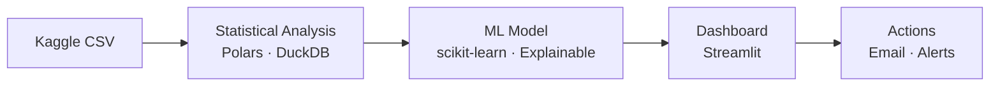

**📦 Livrables Attendus**
1. **Analyse exploratoire** des facteurs de départ
2. **Tests statistiques** (chi2, t-test, ANOVA)
3. **Modèle prédictif** interprétable (logistic, trees)
4. **Dashboard RH** avec profils à risque
5. **Recommandations** concrètes par profil

**🎯 Critères de Réussite**
- AUC > 0.85 sur prédiction départ
- Identification top 5 facteurs
- Plan d'action RH personnalisé

**🛠️ Stack Recommandée**
- **Analysis** : Polars, scipy
- **ML** : scikit-learn, SHAP
- **Viz** : Streamlit, Plotly
- **Deploy** : Streamlit Cloud

---

### 10. Supply Chain Analytics

**🎯 Problématique Business**
Le distributeur subit 15% de ruptures et 30% de surstocks. Objectif : optimiser les niveaux de stock et prédire les ruptures.

**📊 Dataset**
- **Source** : [Supply Chain Dataset](https://www.kaggle.com/datasets/harshsingh2209/supply-chain-dataset)
- **Simulation** : Générateur Python pour events logistiques
- **Volume** : 180k commandes, 20 entrepôts
- **Features** : Ventes, stocks, délais, saisonnalité

**🏗️ Architecture Technique**
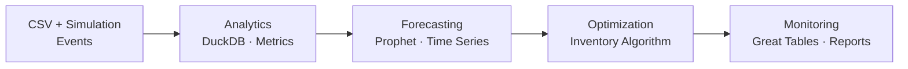

**📦 Livrables Attendus**
1. **KPIs supply chain** (taux service, rotation)
2. **Segmentation ABC/XYZ** des produits
3. **Prévisions demande** avec Prophet
4. **Calculateur stock** sécurité optimal
5. **Tableaux de bord** avec great_tables

**🎯 Critères de Réussite**
- Réduction ruptures de 50%
- Optimisation stocks de 20%
- Alertes automatiques fonctionnelles

**🛠️ Stack Recommandée**
- **Analytics** : DuckDB + Polars
- **Forecasting** : Prophet
- **Viz** : great_tables, Plotly
- **Automation** : Python scripts

---

## ⚙️ DATA ENGINEER (5 projets)

### 11. Pipeline Crypto Trading

**🎯 Problématique Business**
Analyser les cryptos nécessite des données temps réel multi-sources. Objectif : pipeline robuste pour 50+ cryptos avec historique et live.

**📊 Dataset**
- **APIs publiques** : [CoinGecko API](https://www.coingecko.com/en/api) (gratuit)
- **Historique** : [Binance API](https://binance-docs.github.io/apidocs/) (gratuit)
- **Volume** : 50 cryptos, données minute
- **Features** : Prix, volume, market cap, social metrics

**🏗️ Architecture Technique**
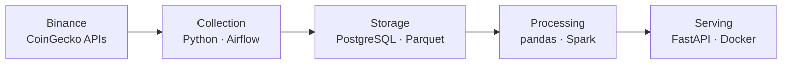

**📦 Livrables Attendus**
1. **DAGs Airflow** pour orchestration des collectes
2. **Storage PostgreSQL** + Parquet pour historique
3. **Processing Spark** pour agrégations (si volume important)
4. **API REST** avec FastAPI pour servir les données
5. **Monitoring** avec logs et métriques Airflow

**🎯 Critères de Réussite**
- Pipeline Airflow stable avec retry logic
- Données collectées toutes les minutes
- API performante pour backtesting

**🛠️ Stack Recommandée**
- **Orchestration** : Apache Airflow
- **Storage** : PostgreSQL, Parquet
- **Processing** : pandas ou PySpark
- **API** : FastAPI, Docker
- **Cloud** : AWS S3 ou Azure Blob (optionnel)

---

### 12. ETL Open Data Gouvernement

**🎯 Problématique Business**
Les données publiques sont éparpillées et mal formatées. Objectif : créer un data warehouse unifié pour analyses citoyennes.

**📊 Dataset**
- **Sources multiples** :
  - [data.gouv.fr API](https://doc.data.gouv.fr/api/reference/)
  - [INSEE API](https://api.insee.fr/catalogue/)
  - [OpenDataSoft](https://public.opendatasoft.com/api/v2/)
- **Volume** : 100+ datasets publics
- **Formats** : CSV, JSON, XML, APIs

**🏗️ Architecture Technique**
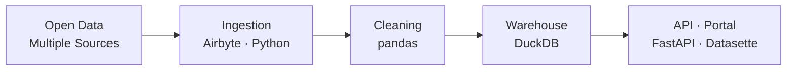

**📦 Livrables Attendus**
1. **Catalogue datasets** avec métadonnées
2. **Pipeline ETL** générique multi-format
3. **Data quality** checks automatisés
4. **API unifiée** REST + GraphQL
5. **Data portal** avec Datasette

**🎯 Critères de Réussite**
- 50+ datasets intégrés
- Update automatique quotidien
- Documentation API complète

**🛠️ Stack Recommandée**
- **ETL** : Python, Airbyte
- **Storage** : DuckDB
- **Quality** : Great Expectations
- **API** : FastAPI, Strawberry GraphQL
- **Portal** : Datasette

---

### 13. Streaming Bluesky Analytics

**🎯 Problématique Business**
Analyser les tendances sociales nécessite du traitement en flux continu. Objectif : pipeline de sentiment analysis sur sujets trending en temps réel.

**📊 Dataset**
- **Source streaming** : [Bluesky Jetstream](https://docs.bsky.app/docs/advanced-guides/firehose) (WebSocket public, sans authentification)
- **Volume** : ~300-500 événements/seconde sur le firehose complet, filtrable par keywords
- **Features** : Texte, métriques d'engagement, user info, timestamps

**🏗️ Architecture Technique**
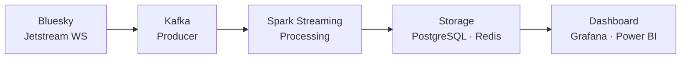

**📦 Livrables Attendus**
1. **Producer Kafka** pour ingestion événements Bluesky
2. **Spark Streaming** pour processing temps réel
3. **Pipeline ML** sentiment avec scikit-learn
4. **Storage PostgreSQL** pour analytics
5. **Dashboard temps réel** Grafana ou Power BI

**🎯 Critères de Réussite**
- Processing < 1 sec par batch
- Détection trending topics en temps réel
- Architecture scalable avec Kafka/Spark

**🛠️ Stack Recommandée**
- **Streaming** : Apache Kafka, Apache Spark
- **ML** : scikit-learn, TensorFlow
- **Storage** : PostgreSQL, Redis
- **Viz** : Grafana, Power BI
- **Deploy** : Docker Compose

---

### 14. Data Quality Platform

**🎯 Problématique Business**
Les équipes data passent 40% du temps à debugger des erreurs de qualité. Objectif : plateforme de monitoring automatisé.

**📊 Dataset**
- **Sources** : Vos propres projets data !
- **Simulation** : Générateur de données avec anomalies
- **Volume** : Multi-sources, multi-formats
- **Tests** : Schéma, distribution, business rules

**🏗️ Architecture Technique**
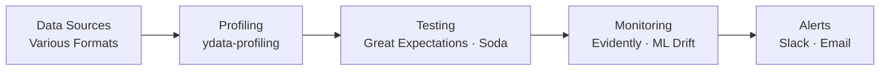

**📦 Livrables Attendus**
1. **Auto-profiling** des nouveaux datasets
2. **Test suite** avec Great Expectations
3. **Drift detection** pour ML data
4. **Dashboard qualité** centralisé
5. **Alerting** multi-canal configurable

**🎯 Critères de Réussite**
- Détection 95% des anomalies data
- Réduction 50% temps debugging
- Adoption par toute l'équipe data

**🛠️ Stack Recommandée**
- **Profiling** : ydata-profiling
- **Testing** : Great Expectations, Soda
- **Drift** : Evidently AI
- **Orchestration** : Prefect
- **Monitoring** : Metabase

---

### 15. Modern Data Stack Local

**🎯 Problématique Business**
Construire une infrastructure data moderne sans cloud pour apprendre. Objectif : stack complète tournant sur un laptop avec les outils du marché.

**📊 Dataset**
- **NYC Taxi** : [TLC Trip Data](https://www.nyc.gov/site/tlc/about/tlc-trip-record-data.page)
- **E-commerce** : [Brazilian Olist](https://www.kaggle.com/datasets/olistbr/brazilian-ecommerce)
- **IoT simulé** : Générateur Python
- **Volume** : 10GB+ pour tester les limites

**🏗️ Architecture Technique**
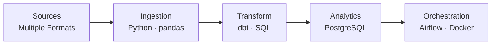

**📦 Livrables Attendus**
1. **Architecture complète** avec Docker Compose
2. **Pipeline ETL** Python + pandas
3. **Transformations dbt** pour modélisation
4. **PostgreSQL** comme data warehouse
5. **Orchestration Airflow** pour automatisation

**🎯 Critères de Réussite**
- Stack complète fonctionnelle en local
- Pipeline reproductible via Docker
- Documentation claire pour réutilisation

**🛠️ Stack Recommandée**
- **Orchestration** : Apache Airflow
- **ETL** : Python, pandas
- **Transform** : dbt
- **Database** : PostgreSQL
- **BI** : Power BI Desktop ou Tableau Public
- **Containers** : Docker Compose

---

## 💡 Conseils pour Réussir

### 🎯 Choix du Projet
- **Alignez avec votre objectif** : startup → full-stack, entreprise → spécialisation
- **Commencez petit** : MVP en 2 semaines, itérez ensuite
- **Documentez tout** : choix techniques, trade-offs, apprentissages

### 🚀 Développement
- **Git from day 1** : commits atomiques, branches features
- **Tests** : au minimum sur les fonctions critiques
- **CI/CD** : GitHub Actions (gratuit)
- **Data versioning** : DVC pour les gros fichiers

### 📖 Documentation
- **README complet** : problème, solution, démo GIF
- **Setup guide** : one-click install idéalement
- **Architecture** : diagrammes avec Mermaid
- **Blog post** : votre parcours et learnings

### 🎤 Présentation
- **Business first** : commencez par l'impact
- **Démo live** : préparez une démo qui marche
- **Code walkthrough** : montrez les parties intéressantes
- **Lessons learned** : soyez honnête sur les difficultés

### 🌟 Pour aller plus loin
- **Contribuez** à des projets open source data
- **Participez** aux compétitions Kaggle (top 50%)
- **Bloguez** sur dev.to ou Medium
- **Streamez** votre code sur Twitch/YouTube

---

## 🔗 Ressources Complémentaires

### APIs Gratuites
- [Public APIs](https://github.com/public-apis/public-apis) - Liste massive d'APIs
- [RapidAPI](https://rapidapi.com/hub) - Hub d'APIs avec free tier
- [JSONPlaceholder](https://jsonplaceholder.typicode.com/) - API de test

### Datasets de Qualité
- [Awesome Public Datasets](https://github.com/awesomedata/awesome-public-datasets)
- [Google Dataset Search](https://datasetsearch.research.google.com/)
- [Registry of Open Data on AWS](https://registry.opendata.aws/)
- [data.world](https://data.world/) - Communauté datasets

### Outils Modernes
- [DuckDB](https://duckdb.org/) - OLAP dans votre laptop
- [Polars](https://pola.rs/) - DataFrames ultra-rapides
- [Marimo](https://marimo.io/) - Notebooks réactifs
- [Evidence](https://evidence.dev/) - BI as code
- [Great Tables](https://posit-dev.github.io/great-tables/) - Tableaux magnifiques

### Learning Resources
- [DataTalks.Club](https://datatalks.club/) - Communauté et bootcamps gratuits
- [Made With ML](https://madewithml.com/) - MLOps best practices
- [Eugene Yan's Blog](https://eugeneyan.com/) - Applied ML
- [Locally Optimistic](https://locallyoptimistic.com/) - Data leadership

---

**Prêt à démarrer ?** 
1. Choisissez UN projet qui vous motive
2. Créez votre repo GitHub
3. Commencez par un MVP simple
4. Itérez et améliorez
5. Partagez vos progrès !

**Besoin d'aide ?** La communauté data est bienveillante. N'hésitez pas à demander sur X/LinkedIn :)

---

*Ce guide est vivant - vos PRs sont les bienvenues pour ajouter de nouveaux datasets/APIs !*
